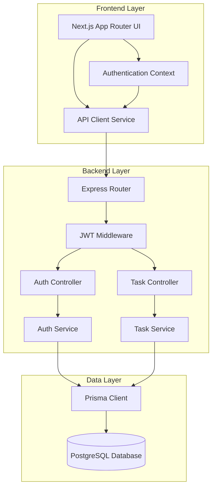

# Design Document: Task Management System

## Overview

The Task Management System is a full-stack web application built with a Node.js/TypeScript backend API and Next.js frontend. The system provides secure user authentication using JWT tokens and comprehensive task management capabilities with CRUD operations, pagination, filtering, and search functionality.

The architecture follows a clean separation between the backend API (data and business logic) and frontend client (user interface and experience), connected via RESTful HTTP endpoints.

## Architecture



### Technology Stack

**Backend:**
- Node.js with TypeScript for type safety and modern JavaScript features
- Express.js for HTTP server and routing
- Prisma ORM for database operations and type-safe queries
- PostgreSQL for reliable data persistence
- JWT for stateless authentication
- bcrypt for secure password hashing
- Zod for runtime validation

**Frontend:**
- Next.js 14+ with App Router for modern React development
- TypeScript for type safety
- Tailwind CSS for responsive styling
- React Hook Form for form management
- Axios for HTTP client operations
- React Query for server state management

## Components and Interfaces

### Backend API Components

#### Authentication Service
Handles user registration, login, token generation, and validation.

```typescript
interface AuthService {
  register(userData: RegisterRequest): Promise<AuthResponse>
  login(credentials: LoginRequest): Promise<AuthResponse>
  refreshToken(refreshToken: string): Promise<TokenResponse>
  logout(refreshToken: string): Promise<void>
  validateAccessToken(token: string): Promise<User>
}

interface RegisterRequest {
  email: string
  password: string
  name: string
}

interface LoginRequest {
  email: string
  password: string
}

interface AuthResponse {
  user: User
  accessToken: string
  refreshToken: string
}

interface TokenResponse {
  accessToken: string
  refreshToken: string
}
```

#### Task Service
Manages all task-related operations with user authorization.

```typescript
interface TaskService {
  createTask(userId: string, taskData: CreateTaskRequest): Promise<Task>
  getUserTasks(userId: string, query: TaskQuery): Promise<PaginatedTasks>
  getTaskById(userId: string, taskId: string): Promise<Task>
  updateTask(userId: string, taskId: string, updates: UpdateTaskRequest): Promise<Task>
  toggleTaskStatus(userId: string, taskId: string): Promise<Task>
  deleteTask(userId: string, taskId: string): Promise<void>
}

interface TaskQuery {
  page?: number
  limit?: number
  status?: TaskStatus
  search?: string
}

interface PaginatedTasks {
  tasks: Task[]
  pagination: {
    page: number
    limit: number
    total: number
    totalPages: number
  }
}
```

#### JWT Middleware
Protects routes and extracts user information from tokens.

```typescript
interface JWTMiddleware {
  authenticate(req: Request, res: Response, next: NextFunction): void
  extractUser(token: string): Promise<User>
}
```

### Frontend Components

#### Authentication Context
Manages authentication state across the application.

```typescript
interface AuthContextType {
  user: User | null
  login: (credentials: LoginRequest) => Promise<void>
  register: (userData: RegisterRequest) => Promise<void>
  logout: () => void
  isLoading: boolean
  isAuthenticated: boolean
}
```

#### API Client Service
Handles HTTP requests with automatic token management.

```typescript
interface APIClient {
  auth: {
    register: (data: RegisterRequest) => Promise<AuthResponse>
    login: (data: LoginRequest) => Promise<AuthResponse>
    refresh: () => Promise<TokenResponse>
    logout: () => Promise<void>
  }
  tasks: {
    create: (data: CreateTaskRequest) => Promise<Task>
    getAll: (query: TaskQuery) => Promise<PaginatedTasks>
    getById: (id: string) => Promise<Task>
    update: (id: string, data: UpdateTaskRequest) => Promise<Task>
    toggle: (id: string) => Promise<Task>
    delete: (id: string) => Promise<void>
  }
}
```

#### Task Dashboard Component
Main interface for task management with filtering and search.

```typescript
interface TaskDashboardProps {
  initialTasks?: Task[]
}

interface TaskDashboardState {
  tasks: Task[]
  loading: boolean
  filters: TaskFilters
  pagination: PaginationState
}
```

## Data Models

### User Model
```typescript
interface User {
  id: string
  email: string
  name: string
  createdAt: Date
  updatedAt: Date
}

// Database schema (Prisma)
model User {
  id        String   @id @default(cuid())
  email     String   @unique
  name      String
  password  String
  tasks     Task[]
  createdAt DateTime @default(now())
  updatedAt DateTime @updatedAt
}
```

### Task Model
```typescript
enum TaskStatus {
  PENDING = 'pending',
  COMPLETED = 'completed'
}

interface Task {
  id: string
  title: string
  description?: string
  status: TaskStatus
  userId: string
  createdAt: Date
  updatedAt: Date
}

// Database schema (Prisma)
model Task {
  id          String     @id @default(cuid())
  title       String
  description String?
  status      TaskStatus @default(PENDING)
  userId      String
  user        User       @relation(fields: [userId], references: [id], onDelete: Cascade)
  createdAt   DateTime   @default(now())
  updatedAt   DateTime   @updatedAt
}
```

### Refresh Token Model
```typescript
interface RefreshToken {
  id: string
  token: string
  userId: string
  expiresAt: Date
  createdAt: Date
}

// Database schema (Prisma)
model RefreshToken {
  id        String   @id @default(cuid())
  token     String   @unique
  userId    String
  user      User     @relation(fields: [userId], references: [id], onDelete: Cascade)
  expiresAt DateTime
  createdAt DateTime @default(now())
}
```

## Correctness Properties

*A property is a characteristic or behavior that should hold true across all valid executions of a system-essentially, a formal statement about what the system should do. Properties serve as the bridge between human-readable specifications and machine-verifiable correctness guarantees.*

### Authentication Properties

**Property 1: Valid registration creates accounts**
*For any* valid user registration data (unique email, valid password, non-empty name), the Authentication Service should successfully create a new user account with hashed password
**Validates: Requirements 1.1**

**Property 2: Duplicate email prevention**
*For any* email address that already exists in the system, attempting to register with that email should return an error and prevent account creation
**Validates: Requirements 1.2**

**Property 3: Registration input validation**
*For any* invalid registration data (missing fields, invalid email format, weak password), the Authentication Service should return appropriate validation errors
**Validates: Requirements 1.3**

**Property 4: Valid login returns tokens**
*For any* valid user credentials (existing email and correct password), the Authentication Service should return both access and refresh tokens along with user data
**Validates: Requirements 2.1, 2.3**

**Property 5: Invalid login rejection**
*For any* invalid credentials (non-existent email or incorrect password), the Authentication Service should return an authentication error without tokens
**Validates: Requirements 2.2**

**Property 6: Access token expiration**
*For any* generated access token, it should expire after 15 minutes and become invalid for API access
**Validates: Requirements 2.4**

**Property 7: Refresh token lifecycle**
*For any* generated refresh token, it should remain valid for 7 days and successfully generate new access tokens when used
**Validates: Requirements 2.5**

**Property 8: Token refresh functionality**
*For any* expired access token with a valid refresh token, the Authentication Service should issue a new access token
**Validates: Requirements 3.1**

**Property 9: Invalid refresh token handling**
*For any* invalid or expired refresh token, the Authentication Service should reject the refresh request and require full re-authentication
**Validates: Requirements 3.2**

**Property 10: Logout token invalidation**
*For any* user logout operation, all associated tokens (access and refresh) should be invalidated and become unusable
**Validates: Requirements 3.3**

### Task Management Properties

**Property 11: Task creation with user association**
*For any* valid task data (non-empty title, optional description) and authenticated user, the Task Service should create a new task associated with that user
**Validates: Requirements 4.1**

**Property 12: Task creation validation**
*For any* invalid task data (empty or whitespace-only title), the Task Service should return validation errors and prevent task creation
**Validates: Requirements 4.2**

**Property 13: Task default values**
*For any* newly created task, the system should set default status to pending and assign creation/modification timestamps
**Validates: Requirements 4.3**

**Property 14: User task isolation**
*For any* user requesting their tasks, the Task Service should return only tasks belonging to that user and no tasks from other users
**Validates: Requirements 5.1**

**Property 15: Pagination consistency**
*For any* paginated task request, the returned data should include correct page metadata and the total number of tasks should equal the sum across all pages
**Validates: Requirements 5.2**

**Property 16: Status filtering accuracy**
*For any* task status filter, all returned tasks should match the specified status and no tasks with different statuses should be included
**Validates: Requirements 5.3**

**Property 17: Title search functionality**
*For any* search term, all returned tasks should contain the search term in their title (case-insensitive) and no tasks without the term should be included
**Validates: Requirements 5.4**

**Property 18: Task update authorization and functionality**
*For any* task update by its owner with valid data, the task should be modified with the new data and timestamp updated; for any update attempt by non-owners, an authorization error should be returned
**Validates: Requirements 6.1, 6.2, 6.4**

**Property 19: Task update validation**
*For any* invalid task update data, the Task Service should return validation errors and leave the task unchanged
**Validates: Requirements 6.3**

**Property 20: Task status toggle**
*For any* task status toggle by its owner, the status should switch between pending and completed states, and the modified timestamp should be updated
**Validates: Requirements 7.1, 7.3**

**Property 21: Task operation authorization**
*For any* task operation (update, toggle, delete, retrieve) attempted by a user who doesn't own the task, the system should return an authorization error
**Validates: Requirements 6.2, 7.2, 8.2, 11.2**

**Property 22: Task deletion**
*For any* task deletion by its owner, the task should be permanently removed from the system and return success confirmation
**Validates: Requirements 8.1, 8.3**

**Property 23: Individual task retrieval**
*For any* task ID requested by its owner, the complete task details should be returned; for non-existent task IDs, a not found error should be returned
**Validates: Requirements 11.1, 11.3**

### System Properties

**Property 24: Input validation coverage**
*For any* API endpoint, invalid input data should be rejected with appropriate validation errors and proper HTTP status codes
**Validates: Requirements 9.2, 9.3**

**Property 25: Authentication protection**
*For any* task-related endpoint, requests without valid authentication tokens should be rejected with 401 unauthorized status
**Validates: Requirements 9.4**

**Property 26: Frontend token management**
*For any* expired access token during frontend operations, the system should automatically attempt token refresh and retry the operation seamlessly
**Validates: Requirements 3.5, 10.5**

## Error Handling

### Authentication Errors
- **401 Unauthorized**: Invalid or expired tokens, failed login attempts
- **400 Bad Request**: Invalid registration data, malformed requests
- **409 Conflict**: Duplicate email registration attempts
- **500 Internal Server Error**: Database connection issues, unexpected server errors

### Task Management Errors
- **400 Bad Request**: Invalid task data, malformed query parameters
- **401 Unauthorized**: Missing or invalid authentication tokens
- **403 Forbidden**: Attempting to access tasks owned by other users
- **404 Not Found**: Requesting non-existent tasks
- **422 Unprocessable Entity**: Valid format but business rule violations
- **500 Internal Server Error**: Database errors, unexpected server failures

### Error Response Format
All API errors follow a consistent structure:
```typescript
interface ErrorResponse {
  error: {
    code: string
    message: string
    details?: Record<string, string[]>
  }
  timestamp: string
  path: string
}
```

### Frontend Error Handling
- Network errors: Retry with exponential backoff
- Authentication errors: Redirect to login page
- Validation errors: Display field-specific error messages
- Server errors: Show user-friendly error notifications
- Token refresh failures: Force re-authentication

## Testing Strategy

### Dual Testing Approach

The system employs both unit testing and property-based testing for comprehensive coverage:

**Unit Tests:**
- Verify specific examples and edge cases
- Test integration points between components
- Validate error conditions and boundary values
- Focus on concrete scenarios and known failure modes

**Property-Based Tests:**
- Verify universal properties across all inputs
- Test system behavior with randomized data
- Ensure correctness properties hold under all conditions
- Provide comprehensive input coverage through generation

### Property-Based Testing Configuration

**Framework:** fast-check for TypeScript/JavaScript property-based testing
**Configuration:** Minimum 100 iterations per property test
**Test Tagging:** Each property test references its design document property

Tag format: `// Feature: task-management-system, Property {number}: {property_text}`

### Testing Implementation Strategy

**Backend Testing:**
- Unit tests for individual service methods and middleware
- Property tests for authentication flows and task operations
- Integration tests for database operations and API endpoints
- Mock external dependencies while testing real business logic

**Frontend Testing:**
- Unit tests for utility functions and form validation
- Property tests for state management and API integration
- Component tests for user interactions and error handling
- End-to-end tests for critical user workflows

**Database Testing:**
- Property tests for data integrity and constraints
- Unit tests for complex queries and migrations
- Performance tests for pagination and search operations

### Test Data Management

**Property Test Generators:**
- User data: Generate valid/invalid emails, passwords, names
- Task data: Generate various titles, descriptions, statuses
- Authentication: Generate tokens with different expiration times
- Edge cases: Empty strings, special characters, boundary values

**Test Database:**
- Isolated test database for each test suite
- Automatic cleanup between test runs
- Seed data for consistent integration testing
- Transaction rollback for unit test isolation